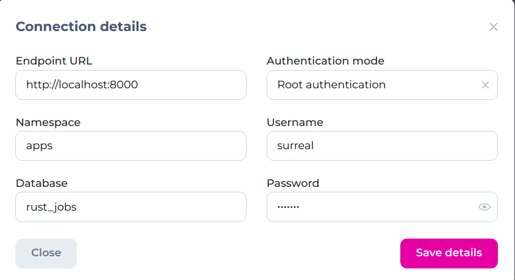

# rust-jobs

## Running locally

```bash
$ docker compose up -d
```

This will expose surrealdb on the port `8000`
The one can use https://surrealist.app/ and configure it like 



The password is surreal (see in `docker-compose.yaml`)